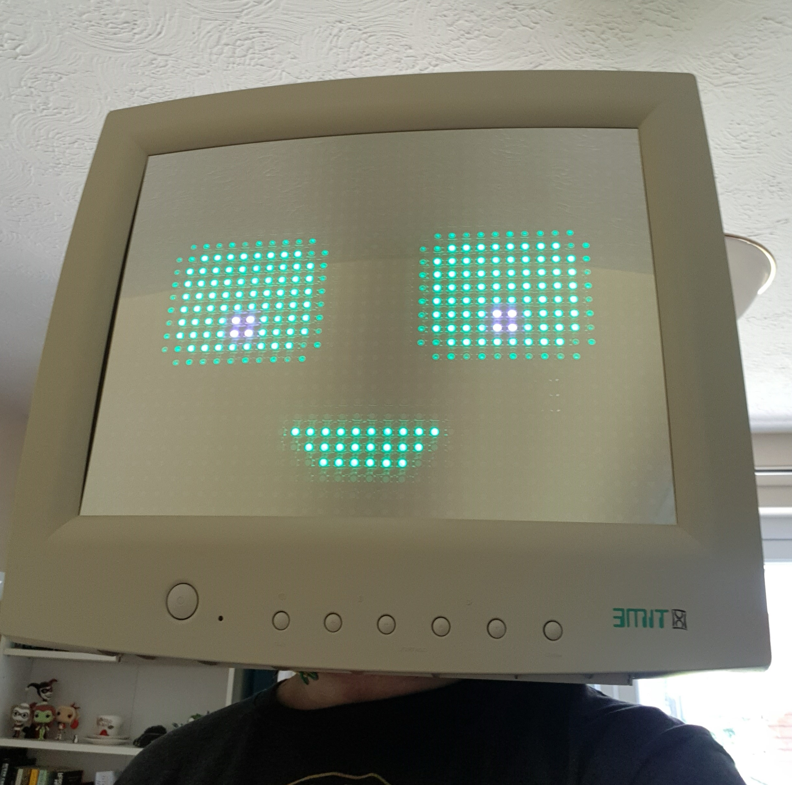
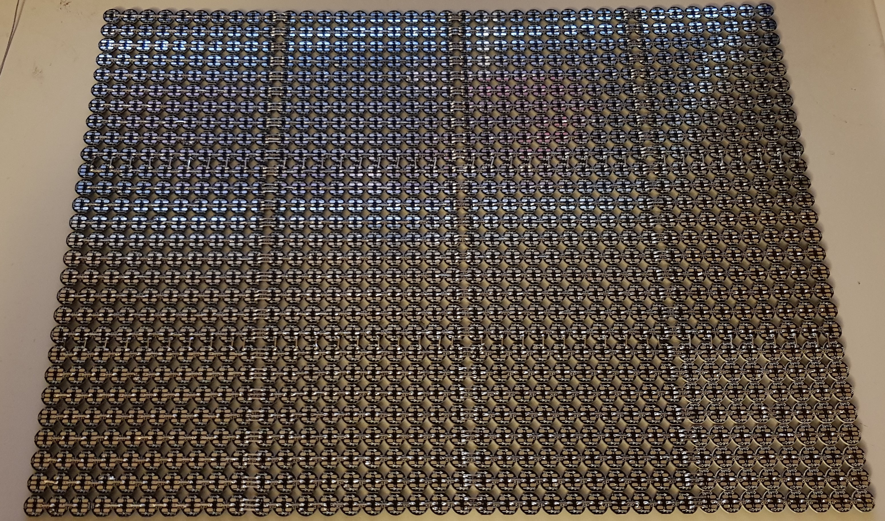
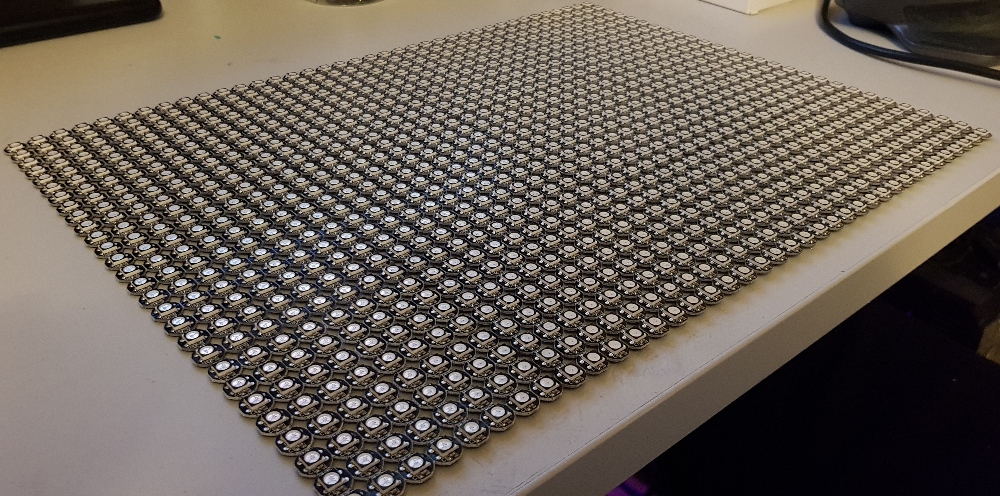
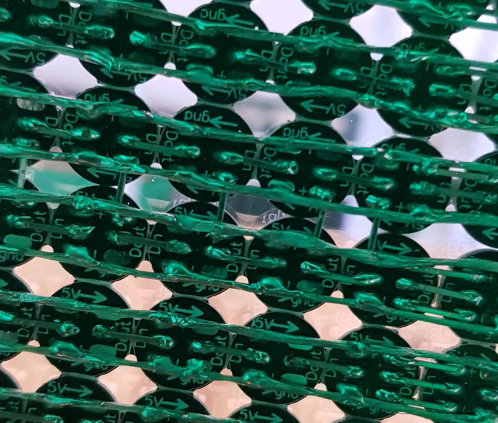
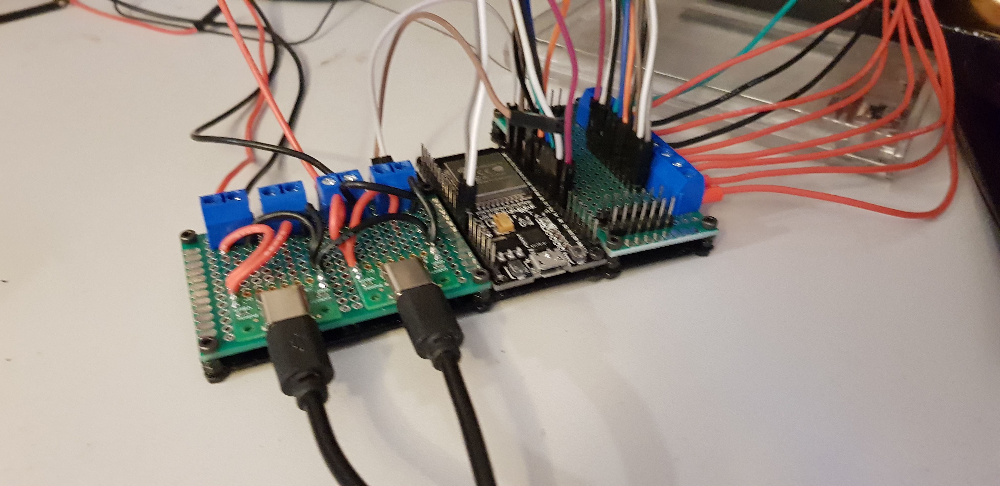

# CRT Helm - An object head with LED display & Remote

My goal for this project was to improve on previous object head cosplay by increasing the resolution of the display and adding extra features such as a wireless remote.
This repo contains the hardware designs and firmware projects for the display controller and the remote control.

This code is not very portable/transferrable to other projects, but some attempt has been made to make it adaptable to different display sizes etc YMMV ¯\\\_(ツ)_/¯

## Helmet/Display

### Shell choice

When choosing a shell to use you should consider two things:

1. Does the display look good/fit the style you want? 
2. Is the display a suitable size?

For me, I wanted a 90/00's CRT of a decent size so that I could pack in the most LEDs.
The first CRT head I made was a 14 inch Amstrad TV, and for this version I used an 18 inch XTime CRT display from 1999. 
Whilst the larger display made it possible to increase the number of LEDs there's no such thing as a free lunch, so the overall weight is also greatly increased (approx kerb weight of 5kg)

> I recommend a maximum of 14inch display to minimise neck strain. 

### Display
More LEDs == More better, so I have increased the resolution from 17x13 (221) to 38x28 (1064)! 

Whilst there are higher density addressable LED strips available, they often comprise the width of the PCB to get a higher LED/M. This makes them unsuitable for use here, as the aim is to maintain a 1:1 pixel ratio, whilst still being able to see through the gaps.

The individual PCBs are kind of a double-edged sword. 
They come in 10x10 sheets, which means physically aligning all the LEDS to remain square is much easier. 
But as they are designed to be used individually, I had to manually solder every data out (DOUT) to every data in (DIN) of each pcb as well as bussing together all the 5V and GND lines.

> It is for this reason that I recommend that you **don't** do your display this way unless you are confident in your soldering ability, and have a couple days to get it done!

Typical addressable RGB led arrays are in a "serpentine" layout where they snake left to right and right to left to form 1 large chain.
The direction of all the LEDs within the sheets are the same, which means rows snake in rows of 10 each way on the display.
Whilst this layout will add software complexity, its an easy compromise as it makes it possible to stitch the sheets along the 5V or GND pads

I found that the length of a standard PCB header is approximately double the distance between the DOUT and DIN pads of adjacent LEDs and because they are rectangular, they are much stronger than just bridging with solder.

After much cutting and soldering I had stitched and bridged the full display together.
An unseen consequence of this was as the joints cool/contract they bow the whole screen backward. 
Whilst this would be a problem where a flat display was desired, it worked well here as it made mounting against the acrylic easier as well as giving a slight shape (to mimic a CRT).

### Power

When you start getting to this number of LEDs, you have to think about how you'll power it. 
According to QuinLED (check him out), WS2812B leds can pull ~60mA full white, full brightness.
That would mean I'd need a theoretical ~64A 5V supply to cope with that!

In reality, there are a few things we can do to stop this from happening. 
Firstly, in FastLED you can set a max current draw.
This will make an educated guess at the predicted power usage and restrict the overall brightness based on what the LEDs are doing.
Secondly, after the display has been fitted, I recommend playing around with the screen brightness asn you'll probably find setting to too high results is dazzling anyone around you (even with the tint).
Another reduction can be made in animation design. In the core "face animation" most of the LEDs are actually off at any one time, so the power usage is minimised

Most battery packs on the market aren't capable of meeting their specified current on all ports simultaneously, so I chose to use 2 smaller battery packs.
This meant I could have a total system current of ~6A at peak, should it be required.

For weight balancing reasons I mounted mine against the back of the shell using command strips.
It may be tempting to mount them on the outside of the helmet or in a backpack, but they

These battery packs were mounted to the inside of the shell using command strips.
It is important to mount the battery packs inside the helmet, as they are a needed to counterbalance the shell.
Although if you think you'll struggle with the weight you could put the battery in a backpack and mount your head further forward in the shell.

### Controller MCU

When it came to choosing an MCU for this project I had a few requirements:
- Widely available - Important for when I inevitably blow something up.
- Powerful - Needs to be able to control 10 independent FastLED channels
- Built in wifi or bluetooth - For this build I want to have a wireless remote, and dont want to get additional hardware to make that happen.

For this reason I chose to use the ESP32 platform from Espressif.
It's widely available, and has a wealth of software and hardware support (critically FastLED).
Thanks to the hard work of XXXXX the ESP32 has support for using the I2S peripheral to get hardware support for controlling >8 FastLed channels.
The easy to use ESP-NOW protocol stack from Espressif makes it super simple to send data between the helmet controller and remote MCU.

### Screen Mounting

In front of the screen I tinted some 3mm acrylic.
This allows me to see through the display without others being able to see my face inside the helmet.

Because the LED array is bowed (as mentioned above) I was able to secure the tinted acrylic and LEDs to the front bezel using the pressure from holding the sides down.
I 3D printed some ribbed supports to run top-to-bottom down each side, and secured them in place using the existing CRT mounting holes and screws. 
Another happy accident was that the back of the LED array was not flat (due to the number of solder joints) and this allowed me to use common household sponges as an interface, which stops the display slipping vertically. 

### Head Mounting

When it comes to mounting the display on your head I have seen others use upholstery foam glued to the inside of the shell. 
Whilst this can be cost-effective I decided with my display to use a builder's hard hat as a starting point. 
I find that it "grips" your head better and since you wont be covering your ears/head in foam you can hear better as well as not get as warm whilst wearing it.

Depending on the size of your shell, you can cut the top of the helmet with a dremel to create a surface for gluing directly to the shell, or you will have to do what I have done, which was to 3d print a platform on the inside of the shell (to make it flat) and eyeball a spacer between the platform and the top of the hat to stop the display sitting on your shoulders.

I would recommend doing this last, as where you mount the helmet front-to-back in the shell will effect the balance on your head and you want to keep it as balanced as possible when all the electronics/batteries are present.

### Animations

In my experience you get much better performance (framerate) and look when the animations are coded directly in C++, so I ditched SD card BMP and GIF support as they didnt work how I wanted.

Initially I planned to be able to support a number of animations, as well as a few games that people can play on my head (think simple ones like tetris and snake).
I ultimately however decided to base the core function and animations around the face animations that I created. 

The face animation I created is made up of a few layers for eyes, pupils and mouth.
This allows me to modify which way the face is looking outside of twisting my neck, as well as swapping out different parts for different emotions as well as blink!

## Remote Control

Man requirements:
- Rechargeable battery
- Analog Joystick
- As many buttons as I can fit

After some googling I was able to find a pre-made ESP32 based board with a built in 18650 charger.

In my previous projects I have re-used the buttons on the front of the display to cycle the current animation, which is ok if you dont plan on changing it often, but falls short when you want to react to something happening around you as you have to spend 30s cycling though all the animations to get to the one you want.
For that reason I used an off the shelf 4x4 button keypad as this will give me enough flexibility as to how I want to bind the button functions.

After a bit of trial and error I created a daughter board to fit directly onto the ESP32 board, and to translate the correct pins for the joystick and keypad to the ESP32. To protect the battery and for comfort, I 3D printed an enclosure to expose the switch, USB port keypad and joystick.

The remote transmits the joystick XY position and button states continuously at a maximum update period of 50ms. When there is a detected change in joystick position will be sent for every loop scan.

## Software Build Instructions

To build this software you will require the Platform.IO extension to vscode.

1. Clone the latest version of this repo
2. Open each workspace
3. Click build - Platformio should handle getting all other project dependancies.

## Special Thanks

* [PlatformIO Team](https://platformio.org/)
